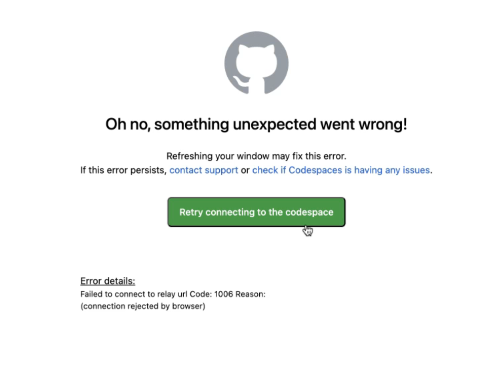

# LLMOps in Azure training 🧑‍🏫

Welcome! In this training you will learn how we can operationalize LLM-based applications in Azure. In this README, you will find the setup instructions for the training environment. When setup is complete, we will follow the exercises in the `exercises` folder. Specifically, we will:

- Run an LLM-based application locally
- Evaluate the application using offline metrics
- Containerize and deploy the application to Azure Container Apps
- Automate the deployment process with CI/CD
- Monitor the application metrics and traces using Azure Monitor
- Iterate on the application based on user feedback

## Setting up the environment 💻

In the following, we'll get your environment setup for the training.
We will use [Github Codespaces](https://github.com/features/codespaces)
as our development environment, as it allows for quick setup and offers
nice capabilities for running apps with automatic port forwarding.

### Setting up your editor

1. Navigate to this repository in Github (you're probably already here)
2. Click on the "<> Code" on the right above the folder structure
3. Select the "Codespaces" tab in the dropdown
4. Click on "Open Codespaces on main"
5. Wait until your environment is set up and your terminal is ready (this may take a while)

    <!-- GitHub flavoured markdown toggle -->

   

   
⨯ Having trouble starting your Codespace?

   1. Codespace doesn't start.

      

      Try the following:
      - disable your VPN
      - create a new codespace

   

6. The setup is done when you you can run the following in a terminal and get valid versions back
   - `az --version`
   - `docker --version`
7. Continue setting up in the [Configure Azure CLI](#configure-azure-cli) section below

(Optional) To access the codespace in your locally installed VS Code Desktop:

1. Open the command palette in your browser version of VS Code (on Mac the shortcut is ⌘+SHIFT+P, on Windows and Linux it is Ctrl+Shift+P).
2. From the command palette, select "Codespaces: Open in VS Code Desktop", and follow the steps to open VS Code locally.

### Configure Azure CLI

1. Go to the [Azure Portal](https://portal.azure.com/) and find the resource group and subscription ID
that we use for this training. The resource group probably starts with `llmops-training`.
2. Run `az login` in the terminal in your Codespace and login to your Azure account.
3. Run `az account set --subscription <SUBSCRIPTION_ID>` with the subscription ID from step 1.
4. Verify your setup by running `az account show` to see your current subscription.
5. Continue setting up in the [Creating personal branch](#creating-personal-branch) section below

### Creating personal branch

It's necessary to create your own personal branch for the CI/CD exercises in this training. You can also use this branch to save your progress. Please do not commit anything to the `main` branch.

1. Set up your git identity by running the following commands in the terminal in your Codespace:
   - `git config --global user.email "<YOUR_EMAIL>"`
   - `git config --global user.name "<YOUR_NAME>"`
2. Run `git checkout -b llmops-training-<YOUR_NAME>` in the terminal in your Codespace to create a new branch with your name.
3. Check if you're on the correct branch by running `git branch` in the terminal. The branch with your name should be marked with an asterisk.
4. Each time you start your Codespace again, make sure you are on your personal branch by running `git checkout llmops-training-<YOUR_NAME>`.
5. Continue setting up in the [Configure environment variables](#configure-environment-variables) section below

### Configure environment variables

1. Copy the provided `.env.template` file to `.env`
2. Fill in the missing values in the `.env` file.  **Note: Your user name should not contain special letters or uppercase letters.**
3. Never commit the `.env` file to the repository
4. Continue setting up in the [Install package and dependencies](#install-package-and-dependencies) section below

### Install package and dependencies

1. Inspect the `src` folder and the `pyproject.toml` file in this repository. These define our package that we will install.
2. Run `uv sync --all-extras` in the terminal in your Codespace to install the package and its dependencies.
3. Run `source .venv/bin/activate` to activate the virtual environment
4. Check that the package is installed by running `(uv run) python -c "import llmops_training"` in the terminal (Note: `uv run` is only needed if you did not activate the `.venv`). If you don't get any errors, the package is installed correctly.
5. That's it. You're all set up and ready to start the exercises! 🎉

## FAQ 🤔

Do I pay for my Codespace?

- No, you get 120 hours per month for free from Github. See the [docs](https://docs.github.com/en/billing/managing-billing-for-github-codespaces/about-billing-for-github-codespaces). You will be warned if you're about to run out of hours. And before you could even pay, you would need to have set up your payment method.

Will I keep my progress if I close the Codespace?

- As long as you don't *delete* the Codespace, you will keep your progress. You can close the browser tab or even shut down your computer, and your Codespace will still be there when you come back. GitHub will warn you if it's about to delete your Codespace due to inactivity. But it's still good practice to commit your changes to your personal branch before you close the Codespace.

Can others access my Codespace?

- No, your Codespace is private to you.

## Exercises 🧑‍💻

See the `/exercises` folder

## Trainer preparation instructions 🧑‍🏫

See the instructions in `docs/trainer-preparation.md`.
For general instuctions, see [Confluence](https://xebia.atlassian.net/wiki/spaces/GDD/pages/10764742361146/LLMOps+on+Azure).
> The slides are accessible on [SharePoint](https://xebiagroup.sharepoint.com/:f:/r/sites/Training/Gedeelde%20documenten/2.%20Training%20Material/1.%20Master%20Slides/4.%20GenAI%20and%20LLMs/LLMOps/1.%20General/Azure?csf=1&web=1&e=fJcksU) (ask trainer for access).
